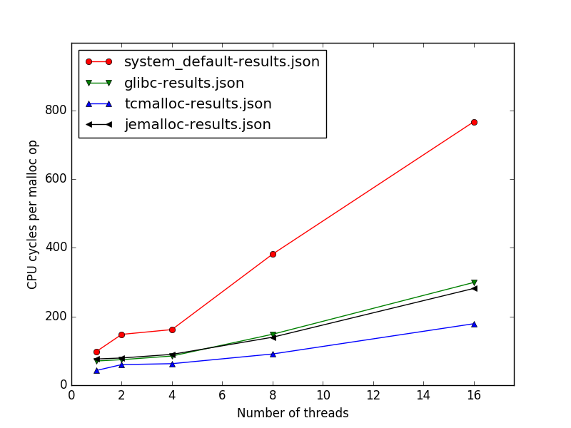
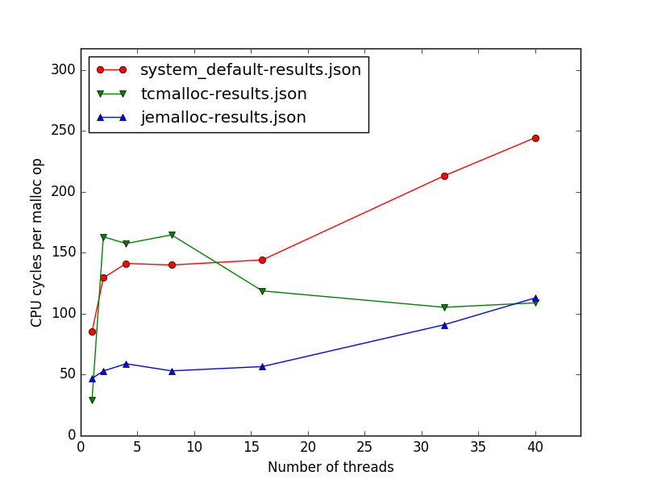

See also more glibc source code and build info. here: [glibc-benchmark-info.md](glibc-benchmark-info.md).


# malloc-benchmarks

Simple benchmarking and plotting scripts to run on any machine to compare different C/C++ malloc implementations.
These scripts are not meant to face any possible problem; quite the opposite.
They will:
1. Download and build [GNU libc](https://www.gnu.org/software/libc/), [Google perftools](https://github.com/gperftools/gperftools), [Jemalloc](http://jemalloc.net/)
1. Use the GNU libc malloc multi-threaded benchmarking utility to generate JSON results for different combinations
   of malloc implementations and numbers of threads
1. Use [Python matplotlib](https://matplotlib.org/) to produce a plot of the results


## Dependencies

If `make` below fails, you may need to install (via `sudo apt install`) one or more of the following. If you like, just begin by running the installation commands below. Last tested in Ubuntu 20.04.

```bash
sudo apt update && sudo apt install \
   numactl g++ clang llvm-dev unzip dos2unix linuxinfo bc libgmp-dev wget \
   cmake python python3 ruby ninja-build libtool autoconf
# For Python
pip3 install matplotlib
```


## How to collect benchmark results and view them

```bash
git clone https://github.com/f18m/malloc-benchmarks.git
cd malloc-benchmarks
make
# OR, time the process too to help you set expectations for how long it will take
time make 
```

Once you have run `make`, the plot will display. To re-plot the results without rerunning the tests, run the following, specifying the correct dirname:
```bash
RESULT_DIRNAME='results/my_dir_name' make plot_results
```

Note that each time you run `make`, all of the benchmark results will be stored in a folder for your computer within the `results` dir.

You can customize the runs be setting environment variables as you call `make`. See the top of the `Makefile` for details. See the default values for `benchmark_nthreads` and `implem_list` in the `Makefile`.  

Examples:
```bash
# Run only 1 and 2 threads, testing only malloc implementations jemalloc and tcmalloc:
NTHREADS="1 2" IMPLEMENTATIONS="jemalloc tcmalloc" time make
```


## How to collect benchmark results on a machine and plot them from another one

On the machine where you want to collect benchmark results:

```bash
git clone https://github.com/f18m/malloc-benchmarks.git
cd malloc-benchmarks
make download build collect_results 
scp -r results IP_OF_OTHER_MACHINE:
```

On the other machine where you want to plot results:

```bash
git clone https://github.com/f18m/malloc-benchmarks.git
cd malloc-benchmarks
mv ../results .
make plot_results
```


## Example benchmarks

The following are some plots of results obtained on different hardware systems using the same benchmarking utility written by the
GNU libc developers. They give an idea of how much performance can differ on different CPU/memory hardware and a varying the number of threads.
Of course, the closer the curves are to zero, the better they are (the lower the better!).

**To verify the version numbers for your benchmarks, look in the following places after running `make`:**
1. **system_default:** run `apt show libc6` to see your system glibc version ([source: "Determining the Installed glibc Version"](https://www.linode.com/docs/guides/patching-glibc-for-the-ghost-vulnerability/)). Ex: `Version: 2.31-0ubuntu9.2`
1. **glibc:** See this file: `malloc-benchmarks/glibc/version.h`
1. **tcmalloc:** See the `TC_VERSION_STRING` value inside `malloc-benchmarks/tcmalloc-install/include/gperftools/tcmalloc.h`
1. **jemalloc:** See the `JEMALLOC_VERSION` value inside `malloc-benchmarks/jemalloc-install/include/jemalloc/jemalloc.h`


<table cellpadding="5" width="100%">
<tbody>


<tr>
<td>


</td>
<td>

Relevant HW information of machine used for testing available [here](results/2018-02-11-desktop-corei5/hardware-inventory.txt)

'system_default' is GNU libc version 2.23 (default for Ubuntu 16.04 LTS)

'glibc' is GNU libc version 2.26

'tcmalloc' is Google gperftools version 2.6.3

'jemalloc' is Google gperftools version 5.0.1
</td>
</tr>


<tr>
<td>



</td>
<td>

Relevant HW information of machine used for testing available [here](results/2018-02-11-desktop-xeon3470/hardware-inventory.txt)

'system_default' is GNU libc version 2.23 (default for Ubuntu 16.04 LTS)

'glibc' is GNU libc version 2.26

'tcmalloc' is Google gperftools version 2.6.3

'jemalloc' is Google gperftools version 5.0.1
</td>
</tr>


<tr>
<td>



</td>
<td>

Relevant HW information of machine used for testing available [here](results/2018-03-17-server-xeon2680/hardware-inventory.txt)

'system_default' is GNU libc version 2.17 (default for Centos 7)

'glibc' curve is missing: the default GCC of Centos 7 is too old to build a recent GNU libc version.

'tcmalloc' is Google gperftools version 2.6.3

'jemalloc' is Google gperftools version 5.0.1
</td>
</tr>


</tbody>
</table>


## Contribute your own benchmarks

If you would like to contribute your benchmarks running on different hardware please
contact me at francesco DOT montorsi AT gmail DOT com.
Thanks.

